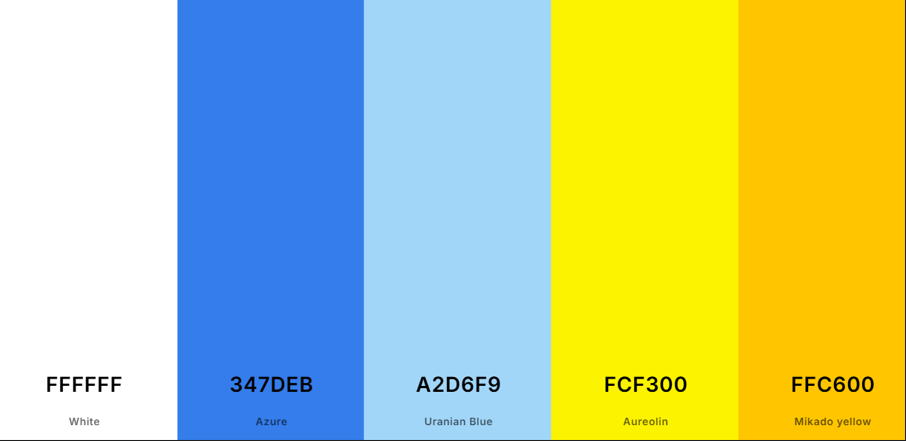
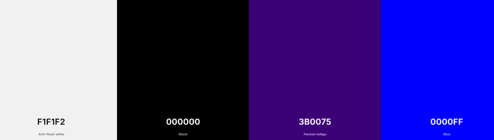
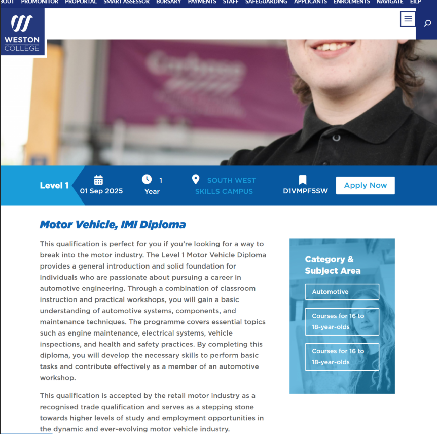
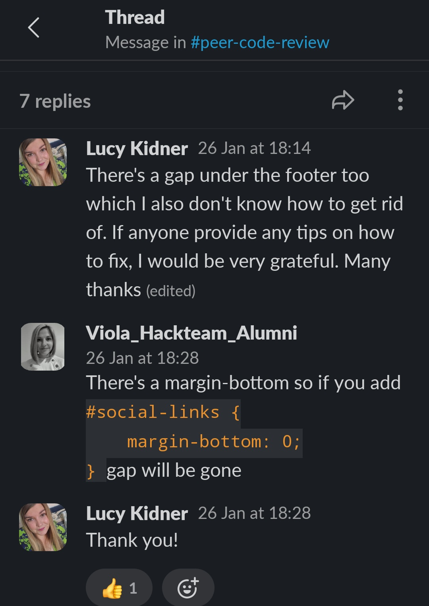
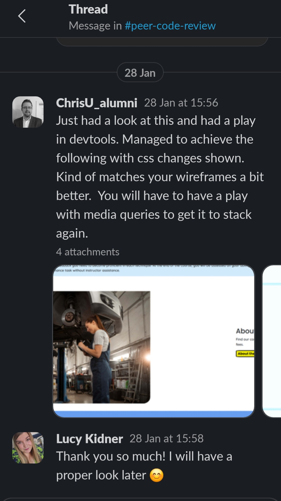
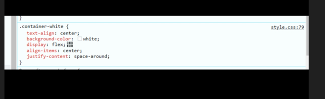
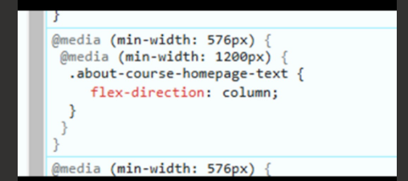
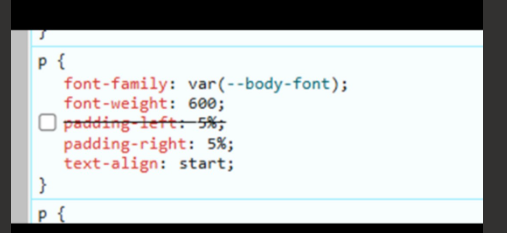

# Clutch Kings College - Basic Car Maintenance Course Website
# Milestone Project 1 - User Centric Frontend Development

<h2 align="center"></h2>

# Table of Contents 

## Contents
1. [Introduction](#introduction)
2. [Live Site](#live-site)
3. [Repository](#repository)
4. [User Experience](#user-experience)
    * [Strategy](#strategy)
         + [Site Owner Goals](#site-owner-goals)
         + [Site Manager Goals](#site-manager-goals)
         + [User Stories](#user-stories)
         + [User Goals](#user-goals)
           + [Must Have](#must-have)
           + [Should Have](#should-have)
           + [Could Have](#could-have)
         + [User Expectations and Requirements](#user-expectations-and-requirements)
    * [Scope](#scope)
        + [Initial Stage Features](#initial-stage-features)
        + [Future Additions](#future-additions)
    * [Structure](#structure)  
        + [Wireframes](#wireframes)
   * [Skeleton](#skeleton)  
        + [Layout](#layout)
          + [Information Architecture](#infomation-architecture)
            + [Navigation Bar](#navigation-bar)
            + [Sub-navigation Bar](#sub-navigation-bar)
            + [Buttons](#buttons)
            + [Footer](#footer)
            + [Thank You Page](#thank-you-page)
            + [404 Error Page](#404-error-page)
   * [Surface](#surface)
        + [Design](#design)
          + [Colour Scheme](#colour-scheme)
          + [Typography](#typography)
          + [Imagery](#imagery)
          + [Icons](#icons)
          + [Logo](#logo)
          + [Favicons](#favicons)
5. [Technologies Used](#technologies-used)
     + [Languages](#languages)
     + [Frameworks Libraries and Programmes](#frameworks-libraries-and-programmes)
       * [Creation](#creation)
       * [Testing](#testing)
       * [Imagery](#imagery)
       * [Miscellaneous](#miscellaneous)
6. [Testing and Validation](#testing-and-validation)
7. [Deployment](#deployment)
     + [GitHub Pages](#github-pages)
     + [Forking the GitHub Repository](#forking-the-github-repository)
     + [Making a Local Clone](#making-a-local-clone)      
8. [Credits](#credits)
     + [Content](#content)
     + [Code](#code)
     + [Acknowledgments](#acknowledgments)
9. [Developer Comments](#developer-comments)
10. [Disclaimer](#disclaimer)

  
# Introduction
* Clutch Kings College is a fictional training provider for the automotive industry. This site focuses specifically on marketing, and gathering sign-ups for their Basic Car Maintenance Course. 

* This is my first milestone project for the Code Institute Level 5 Diploma in Web Application Development.

# Live Site 
[The live site can be viewed here](https://lucyinthesky2111.github.io/milestone-project-one/)

# Repository
[The project repository can be viewed here](https://github.com/lucyinthesky2111/milestone-project-one)

# User Experience
  ## Strategy
  ### Site Owner Goals
  * To market their basic car maintenance course. 
  * To attract a wider range of participants through having an online presence.
  * To receive queries about the course from prospective students. 
  * To increase sign-ups for the course.  

  ### Site Manager Goals
  * For the HTML and CSS code to be clear, logical, and contain explanatory comments in order to ensure the site is easy to update and maintain. 
  * For images to be downloaded to the site manager's computer, not hosted by an external site, to ensure images are always available for the user.  

  ### User Stories
  These can be found in my GitHub [project board](https://github.com/users/lucyinthesky2111/projects/7) for this repository.

  ### User Goals
  ### Must Have
  * To find pertinent details about the course (i.e. when and where it is run, how much it costs and what the entry requirements are) to ascertain whether there are any barriers to attending the course (user story 2).
  * To find a breakdown of the course contents, in order to assess whether it meets their needs and requirements. (user story 2).
  * To find ways to contact the course provider, through a variety of different methods. (user story 3).
  * To see the course provider’s location on an embedded map. (user story 4). 
  * To be able to apply for the course quickly and easily online. (user story 5). 
  * To receive acknowledgment that their online application has been received, which includes feedback as to when they can expect a response. (user story 5).

  ### Should Have
  * To find photos and profiles of the course instructors. (user story 6).
  * To find information about the course provider. (user story 7).

  ### Could Have
  * To read testimonials from current and/or former students. (user story 8).
  * To see a virtual tour of the workshop. (user story 9).
  * To sign-up to receive email notifications when new course dates are added. (user story 10).

### User Expectations and Requirements
* All user story 1 (must-have) 
* To find the website easy to access and navigate on any screen size. 
* For the site to be fully accessible. 
* For the site to be engaging and visually appealing, including high quality images with succinct but adequate descriptions. 
* For any external links to open in a new tab. 
* To find a navigation menu at the top of every page. 
* To find a footer at the bottom of every page. 
* To receive a custom 404 error page which links back to the Homepage, when trying to access an incorrect URL within the site. 

# Scope
## Initial Stage Features

I decided that the following features were all ‘must haves’ or ‘should haves’ (refer to the [user stories](https://github.com/users/lucyinthesky2111/projects/7) for details) at the initial stage to ensure a ‘minimum viable product’. 
* Interactive embedded map showing the college's location.
* Instructor photos and profiles.
* Validated application form.
* Details about the course contents and the course provider.

This is because these features contain vital information the user needs in order to: 1) Decide whether they wish to, and are able to, apply for the course. 2) Apply for the course and/or contact the college.
      
I was able to successfully implement all of the initial stage features.

## Future Additions
I decided that the following features would be nice to have but were not essential for a ‘minimum viable product’.  Therefore, these features have not been implemented at this stage.
* Pages for other courses run by Clutch Kings College, such as the Level 1 Diploma in Light Vehicle Maintenance, which was mentioned in this site. 
* Testimonials from current and former students. 
* Facility to sign up for email notifications when new course dates are added.  
* A virtual tour of the workshop.  

# Structure 
## Wireframes
<h2 align="center">Homepage (Index) </h2>
<h2 align="center">Course Information </h2>
<h2 align="center">About </h2>
<h2 align="center">Our Instructors </h2>
<h2 align="center">Apply and Contact </h2>
<h2 align="center">Thank You </h2>
<h2 align="center">404 Error </h2>

# Skeleton
## Layout
### Information Architecture
* The website consists of a Homepage and 4 further pages: - Course Information, About, Our Instructors and Apply and Contact.  
* Homepage – landing page with brief descriptions of, and links to, the other pages.  
* Course Information –  divided into 2 sections – Course Overview and Course Summary. Course Overview consists of images and corresponding captions for the 8 maintenance tasks taught on the course. Course Summary sets out crucial information about the course in an easy to read table.  
* About –  divided into 2 sections – About Us and About You. About Us consists of text explaining the history of the college and About You describes the target participants for the course.  
* Our Instructors – provides a photo and profile of each of the 5 instructors.
* Apply and Contact* - divided into 3 sections – Apply Here, Find Us and Contact Us.  Apply Here provides a course application form for the user to complete, Find Us provides an embedded Google map showing the College’s location, and Contact Us provides the address, email address, and phone number for Clutch Kings College. *Apply and Contact share a page, as I felt that there was not enough content here to justify splitting them into two pages. Having two pages would unnecessarily increase the amount of clicks the user would have to make to find the required information. 

### Navigation Bar 
* A responsive navigation bar is included on each page of the site, to allow the user to easily navigate between pages without having to go back to the homepage or rely on the browser forward and back buttons. 
* The nav bar is sticky so it is always visible at the top of the page when the user is scrolling the site.
* The links on the nav bar are in black text which appear white when the user hovers over them to maintain readability and accessibility.
* The 'active' link i.e. the page the user is on, is underlined as a visual reminder.
* The links on the nav bar appear as a horizontal list on larger screens and in a drop down menu on smaller screens.
<h2 align="center">Nav bar on desktop </h2>
<h2 align="center">Nav bar on mobile and tablet </h2>

### Sub-navigation Bar
* The Our Instructors, and Apply and Contact pages, both feature sub-navigation bars. 
* The sub-navigation bars feature links to locations within the same page. The links use IDs to allow users to quickly navigate to a specific area on a page.
* To stop pages becoming cluttered, sub-navigation bars have only been added to pages which either contain a considerable amount of content, or are divided into 3 or more sections.
* There is no sub-navigation bar on the Homepage, as this is simply a landing page which provides a brief introduction to the course and then links out to other pages via clickable buttons.
* Sub-navigation links have been added to the Apply and Contact page, as this page contains 3 sections (Apply Here, Find Us, and Contact us). The sub-navigation links allow the user to quickly jump from one section to another.
* Sub-navigation links have been added to the Our Instructors page, as this page contains sections for 5 instructors, and features a considerable amount of content. The sub-navigation links allow the user to quickly jump from one instructor profile to another.
* The sub-navigation links are underlined to indicate to the user that they are clickable links.
* The sub-navigation links are in black text and appear purple once hovered over, to maintain readability and accessibility.
<h2 align="center">Our Instructors sub-nav bar (Mobile)</h2>
<h2 align="center">Our Instructors sub-nav bar (Desktop)</h2>

### Buttons
* Buttons are used throughout the site.
* The buttons are consistent in style and colour across the site. They are light yellow which changes to dark yellow when clicked. 
* The text colour changes from black to purple when the button is clicked. The text remains legible when the button is clicked.
* Navigation buttons are used to link to other pages. These buttons feature a 'directional arrow' pointing to the right, to indicate to the user that clicking the button will direct them to another page.
* 'Back to top' buttons are also included at the bottom of each page, to save the user having to manually scroll back to the top of the page, or rely on features built in to the browser. These buttons feature a 'directional arrow' pointing upwards as a visual cue for the user.
* Several pages also feature a 'call to action' button, which links the user to the application form to make it as quick and easy to apply for the course as possible.
<h2 align="center">Navigation Button</h2>
<h2 align="center">Back to top Button</h2>
<h2 align="center">Call to action Button</h2>

### Footer 
* Each page features a footer which contains a copyright statement, and icons linking to social media pages.
* All the social media links open in a new tab.
* The footer is not sticky so it does not restrict the user's view of the bottom of the screen when scrolling. 
* The icons and text are black with an appropriate hover colour of white to maintain readability and accessibility.
<h2 align="center">Footer (Mobile)</h2>
<h2 align="center">Footer (Desktop)</h2>

### Thank You Page
  * The Thank You page is only accessible when the user successfully submits an application with all the required fields on the ‘Apply Here’ section of the Apply and Contact page. 
  * The page confirms to the user that their application has been submitted successfully and provides feedback as to when they can expect to receive a response.
  * The page includes a handy link to the ‘Contact Us’ section that the user can use if they have any queries, or amendments or additions to their application. For example, if they have made a mistake on their application, they can easily find the contact information they need to notify the college without having to scroll back through the site to find it. 
  * The page also has a button which links the user back to the homepage, which they can use if they do not need to contact the college. 
<h2 align="center">Thank You Page on desktop </h2>
<h2 align="center">Thank You Page on mobile and tablet </h2>

### 404 Error Page
A custom 404 error page displays if the user tries to access an incorrect URL within the site. The page features the site’s navbar and footer, and a button which directs the user back to the homepage. I followed [this guidance](https://docs.github.com/en/pages/getting-started-with-github-pages/creating-a-custom-404-page-for-your-github-pages-site) from Github to create the page.  
<h2 align="center">404 Error Page on desktop </h2>
<h2 align="center">404 Error Page on mobile and tablet </h2>

# Surface
 ## Design
 ### Colour Scheme
 * The colour scheme was designed using [Coolors](https://coolors.co/).
 * All colour combinations were tested for accessibility using [WebAim: Contrast Checker](https://webaim.org/resources/contrastchecker/). 
 * The background colours used in the site are light blue (uranian blue), azure blue and white. 
 * Blue and white were selected as the main colours for the site as these colours were commonly used in the automotive course websites I researched and took inspiration from (see [Credits Content section](#content) for details).
 * This simple, minimal colour scheme was chosen to ensure the site contains enough colour to be visually interesting without being distracting.
 * Alpha values are applied to the blues when they are used as background colours for different sections of the site. 
 * Light blue is used as the background colour for the nav bar and footer.
 * The buttons on the site are yellow to ensure they stand out from the rest of the content. The buttons are light yellow when unclicked and become dark yellow when clicked. 
 * Black is used as the font colour, except for the placeholder text on the application form which is blue to make it stand out. 
 * The black font is contrasted with either anti-flash white (icons and navbar), or Persian indigo (buttons and sub-nav bar links) as the hover colour, to ensure readability and accessibility.
<h2 align="center">Background colour palette </h2>
<h2 align="center">Font colour palette </h2>

  ### Typography
  * When researching automotive course websites, I noticed that rounded fonts were commonly used (see [Credits Content section](#content) for details).
  * Poppins is used for headings and Quicksand is used for body text as they are clean and easy-to-read fonts. 
  * They are rounded, soft fonts with a friendly, approachable appearance which fits with the tone of the website.  
  * Sans serif is the fallback in case either font fails to load correctly. 

   ### Imagery
   ### Aspect Ratios
   Aspect ratios chosen for use in the site were: 
   * 16:9 (hero images)
   * 3:2 (other images)

   16:9 - this aspect ratio was chosen for hero images as these images are designed to span the whole width of the page on all screen sizes and therefore, need to be wide. 16:9 is a very versatile aspect ratio used by lots of modern media formats and provides an immersive viewing experience.

   3:2 - this aspect ratio was chosen as it suits images which are in landscape orientation in their original state, because it makes the images wider than they are tall. 3:2 suits such images especially well as the result is images that are: 
   * visuallly pleasing;
   * wide enough to draw sufficient attention to the focal point without being too wide (such as 16:9 would be);
   * not too square (such as 1:1 would be).

  ### Image Styling
   On the ‘About’ section of the homepage, on small and tablet screens, the Clutch Kings College logo appears with a border around it. This border is hidden on large screens as it becomes slightly distorted. The purpose of the border was also to make the logo appear in line with the other images on the page, when they are centered in the middle of the screen and stacked on top of each other. I felt that this border was not needed on larger screens, where the images all move to the left of the page.
   <h2 align="center">Logo (Mobile)</h2>
   <h2 align="center">Logo (Desktop)</h2>

### Icons
* Icons used are from [Font Awesome](https://fontawesome.com/).
* Icons are used on the footer to indicate links to social media pages.
* Icons are also used on the Course Overview section of the Course Information page, to complement images and text captions which describe each task taught on the course.

### Logo
* The logo was created from a template on [Design.com](https://www.design.com/). The background of the logo was removed using [Canva](https://www.canva.com/). 
* For convenience, clicking the logo on the navbar will always take the user back to the Homepage.

### Favicons
* The favicon was generated using [Favicon.io](https://favicon.io/). 
* The favicon is the Clutch Kings College logo.

# Technologies Used
## Languages
* [HTML5](https://en.wikipedia.org/wiki/HTML5)
* [CSS3](https://en.wikipedia.org/wiki/CSS)

## Frameworks Libraries and Programmes
 ### Creation
  * [Bootstrap version 5.3.3](https://getbootstrap.com/) - was used to create the responsive nav bar that appears on all pages, and the image carousel which appears on the site’s About page. I also used the [breakpoints defined by Bootstrap](https://getbootstrap.com/docs/5.0/layout/breakpoints/) when writing CSS media queries. 
  * [GitPod](https://www.gitpod.io/) – was the initial code editor used.
  * [Visual Studio Code](https://code.visualstudio.com/) – was the code editor used for the remainder of the project. I changed code editors due to Code Institute’s migration from GitPod to VS Code. 
  *	[Git](https://git-scm.com/) – was used for version control.
  * [GitHub](https://github.com/) – was used to create and store the project repository and create the user stories project board.
  *	[Google Fonts](https://fonts.google.com/) – was used to choose and import the fonts used in the site.
  * [Font Awesome](https://fontawesome.com/) – was used to choose and import the icons used in the site. 
  * [Canva](https://www.canva.com/) – was used to create the wireframes. 
  * [Google Chrome Developer Tools](https://developer.chrome.com/docs/devtools/) – was used while building the project to test responsiveness, and for debugging.

  ### Testing
  * [W3C HTML Validator](https://validator.w3.org/) – was used to validate the HTML.
  *	[W3C CSS Validator](https://jigsaw.w3.org/css-validator/) – was used to validate the CSS.
  *	[WAVE Web Accessibility Evaluation Tools](https://wave.webaim.org/) – was used to test the site for accessibility.
  * [Google Chrome Developer Tools (Lighthouse feature)](https://developer.chrome.com/docs/lighthouse/overview) - was used to test the site for Performance, Accessibility, Best Practices and SEO.

  ### Imagery
  * [Unsplash](https://unsplash.com/), [Pexels](https://www.pexels.com/) and [Freepik](https://www.freepik.com/) – were used to source all the images used in the site. 
  * [Tinify](https://tinypng.com/) – was used to optimise all images.
  * [Design](https://www.design.com/) – the Clutch Kings College logo was customised from a template on Design.
  * [Canva](https://www.canva.com/) – was used to remove the background from the logo, and to crop all images to the desired aspect ratio.
  * [Aspect ratio calculator](https://aspectratiocalculator.com/) – was used to pick appropriate aspect ratios for all images used in the site.
  * [Favicon.io](https://favicon.io/) – was used to generate the site’s favicon.
  * [Techsini](https://techsini.com/multi-mockup/) – was used to generate a mockup of the homepage on various screen sizes.
  * [Coolors](https://coolors.co/) – was used to generate the site’s colour scheme.
  *	[WebAIM contrast checker](https://webaim.org/resources/contrastchecker/) – was used to test all colour combinations for accessibility.

 ### Miscellaneous 
 * [ChatGPT](https://openai.com/index/chatgpt/) – was used to generate the college’s name and for proof-reading. 

# Testing and Validation
Please refer to [this file](TESTING.md) for details of the testing and validation undertaken.

# Deployment
## GitHub Pages
This site was deployed to GitHub pages. The steps to deploy a site are as follows:

* Log in to GitHub and navigate to the required repository.
* Navigate to the ‘Settings’ tab on the navbar at the top of the page.
* Navigate to ‘Pages’ on the menu on the left-hand side of the page.
*	Navigate to ‘Build and deployment’ and select ‘Deploy from a branch’ from the dropdown menu under source.
* Select ‘main’ and ‘root’ under branch and click save.
* The page will automatically refresh and a link to the deployed site will appear under ‘Deployments’ on the right-hand side of the page.

## Forking the GitHub Repository
* Log in to GitHub and navigate to the required repository.
* Navigate to the right-hand side of the page and click ‘Fork’. This is located in-line with your repository name underneath the nav bar. 
* Give the forked repository a name of your choosing.
* Amend the repository description if required.
* Tick ‘Copy the main branch only'.
*	Click the ‘Create fork’ button.
* You will now have a copy of the original repository in your GitHub account.

## Making a Local Clone
* Log in to GitHub and navigate to the required repository.
* Click on the ‘Code’ button at the top of the repository and copy the URL. 
* Open Git Bash in your IDE of choice and change the working directory to the location where you want the cloned directory.
* Type git clone, then paste the URL you copied earlier.
* Press enter. Your local clone will be created.

# Credits
## Content
All copy on the website was written by myself. I referred to:
* [Bridgwater and Taunton College Car Maintenance Intermediate](https://www.btc.ac.uk/courses/adult-learning/automotive/car-maintenance-intermediate/) - for inspiration for the course description, font choice and site colour scheme.
<h2 align="center"></h2>
<h2 align="center"></h2>

 * [Weston College Level 1 Motor Vehicle, IMI Diploma](https://www.weston.ac.uk/what-can-i-study/courses-16-18-year-olds/automotive/motor-vehicle-imi-diploma-0) - for inspiration for the course description, font choice and site colour scheme.
 <h2 align="center"></h2>

* [Autotech Training](https://autotechtraining.co.uk/about-us/) - for inspiration for the instructor profiles, font choice and site colour scheme.
<h2 align="center"></h2>

* [Isabella Mitchell Row Gallery website](https://isabella-mitchell.github.io/milestone-project-one/) – For inspiration for the layout of the website. The main sources of inspiration from Row Gallery were the:
  * homepage layout;
  * use of directional arrows on buttons;
  * sub-navigation bar under main navigation bar on ‘shared’ pages and pages with a considerable amount of content.

* [Isabella Mitchell Row Gallery](https://github.com/Isabella-Mitchell/milestone-project-one) and [Deeksha Varma Oh Nuts! Donuts](https://github.com/deeksha-varma/portfolio_project_1) - for inspiration for the structure and content of the README.md and TESTING.md files.
 
## Code
* [Code Institute Love Running walkthrough project](https://github.com/Code-Institute-Solutions/love-running-v3) :-
  - for the code for the social media links in the footer. 
  - for the code for the general styles used to push the footer to the bottom of the page. 
  - for help writing media queries.

  * [Coding Yaar YouTube Video ‘Bootstrap Navbar Hover Effect (color change)’](https://www.youtube.com/watch?v=JH8bWipPcHg) - for the code to add hover effect (colour change functionality) on the Bootstrap navbar.  

  * [Code with Ania Kubow You/tube video ‘12HR+ YouTube Coding Bootcamp!’](https://www.youtube.com/watch?v=Xm4BObh4MhI) - for code to add and style buttons and help with understanding flexbox. 
  
  * [Freecodecamp –Learn HTML forms by building a registration form module](https://www.freecodecamp.org/learn/2022/responsive-web-design/#learn-html-forms-by-building-a-registration-form) – for help creating an HTML form for the application form on the Apply and Contact page. 

  * [OnlineITuts Tutorials YouTube video – How to embed Google Map in HTML using iFrame](https://www.youtube.com/watch?v=ZbBaOKyqlUA) – for help embedding the Google map to show the college’s location on the Apply and Contact page. 

  * [Slaying The Dragon  YouTube Video– Master media queries and responsive CSS web design like a chameleon](https://www.youtube.com/watch?v=K24lUqcT0Ms) – for help writing the media queries. 

  * [Flexbox Froggy](https://flexboxfroggy.com/) – was used for help understanding CSS Flexbox.
  
  * [Viola_Hackteam_Alumni (via Slack)](https://slack.com/intl/en-gb) - for the CSS code to remove a gap underneath the footer.
  <h2 align="center"></h2>

   * [ChrisU_alumni (via Slack)](https://slack.com/intl/en-gb) - for the CSS starter code to make the homepage responsive as per the wireframe design.
  <h2 align="center"></h2>
  <h2 align="center"></h2>
  <h2 align="center"></h2>
  <h2 align="center"></h2>

## Acknowledgments
I would like to thank everyone who helped me in the creation of this project. In particular those who provided some much-needed encouragement when I felt like giving up, proof-read my site, helped me with figuring out errors in my code, and helped me understand complicated concepts. Without their help, this project would never have seen the light of day! Special thanks go to the following people:
* My course tutor Ashley Oliver  
* My friend and colleague Ben Tambling 
* My friend James Newell 
* My sister Meg Kidner
* My mentor Mitko Bachvarov

# Developer Comments
In the creation of this project, I used a combination of Bootstrap code, and custom HTML and CSS. The reason for this was to allow me to deepen my understanding, ensuring I wasn’t overly reliant on any single tool.

When I began this course, my knowledge of web development was minimal, and I had never attempted to create a website before. Along the way, I had to familiarise myself with various new concepts and processes  - such as wireframes, UX design, and markdown - which was both a time-consuming and enjoyable learning experience.

Building this project presented a steep learning curve and required countless hours of effort. Nevertheless, the process has been incredibly valuable, not only in expanding my technical skills but also in refining my working practices and mindset. These lessons will undoubtedly benefit me in future projects.

While the final project is not perfect, I’m proud of it as my first attempt. I’m confident that with everything I’ve learned, my speed and the quality of my work will continue to improve in subsequent projects.

I am excited to further develop my skills and create higher-quality content moving forward.

Overall, I found creating this project to be challenging but also, very enjoyable and rewarding.

# Disclaimer

This project is for educational purposes only and was created for the Code Institute assessed project for the ‘user centric front-end development’ module.  

Clutch Kings College is a fictional training provider. Any similarity to any real college, address or other contact information, or to any persons, living or deceased, is purely coincidental. 
 
Created by Lucy Kidner, 2025. 