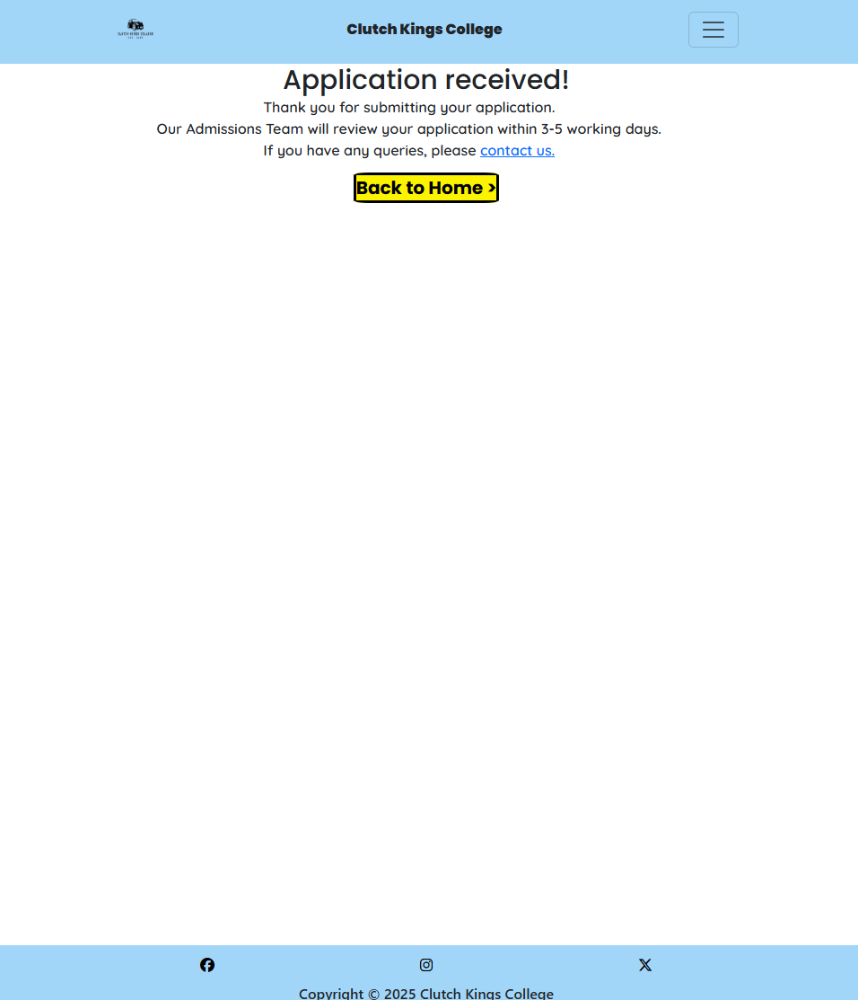
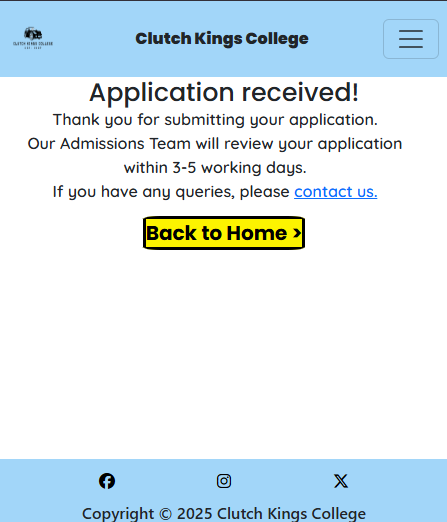

# Clutch Kings College - Basic Car Maintenance Course Website
# Milestone Project 1 - User Centric Frontend Development

<h2 align="center"></h2>

# Table of Contents 

## Contents
1. [Introduction](#introduction)
2. [Live Site](#live-site)
3. [Repository](#repository)
4. [User Experience](#user-experience)
    * [Strategy](#strategy)
         + [Site Owner Goals](#site-owner-goals)
         + [Site Manager Goals](#site-manager-goals)
         + [User Stories](#user-stories)
         + [User Goals](#user-goals)
           + [Must Have](#must-have)
           + [Should Have](#should-have)
           + [Could Have](#could-have)
         + [User Expectations and Requirements](#user-expectations-and-requirements)
    * [Scope](#scope)
        + [Initial Stage Features](#initial-stage-features)
        + [Future Additions](#future-additions)
    * [Structure](#structure)  
        + [Wireframes](#wireframes)
   * [Skeleton](#skeleton)  
        + [Layout](#layout)
          + [Information Architecture](#infomation-architecture)
            + [Navigation Bar](#navigation-bar)
            + [Sub-navigation Bar](#sub-navigation-bar)
            + [Buttons](#buttons)
            + [Footer](#footer)
            + [Thank You Page](#thank-you-page)
            + [404 Error Page](#404-error-page)
   * [Surface](#surface)
        + [Design](#design)
          + [Colour Scheme](#colour-scheme)
          + [Typography](#typography)
          + [Imagery](#imagery)
          + [Icons](#icons)
          + [Logo](#logo)
          + [Favicons](#favicons)
5. [Technologies Used](#technologies-used)
     + [Languages](#languages)
     + [Frameworks Libraries and Programmes](#frameworks-libraries-and-programmes)
6. [Testing and Validation](#testing-and-validation)
7. [Deployment](#deployment)
     + [GitHub Pages](#github-pages)
     + [Forking the GitHub Repository](#forking-the-github-repository)
     + [Making a Local Clone](#making-a-local-clone)      
8. [Credits](#credits)
     + [Content](#content)
     + [Code](#code)
     + [Media](#media)
     + [Acknowledgments](#acknowledgments)
9. [Developer Comments](#developer-comments)
10. [Disclaimer](#disclaimer)

  
# Introduction
* Clutch Kings College is a fictional training provider for the automotive industry. This site focuses specifically on marketing, and gathering sign-ups for their Basic Car Maintenance Course. 

* This is my first milestone project for the Code Institute Level 5 Diploma in Web Application Development.

# Live Site 
[The live site can be viewed here](https://lucyinthesky2111.github.io/milestone-project-one/)

# Repository
[The project repository can be viewed here](https://github.com/lucyinthesky2111/milestone-project-one)

# User Experience
  ## Strategy
  ### Site Owner Goals
  * To market their basic car maintenance course. 
  * To attract a wider range of participants through having an online presence.
  * To receive queries about the course from prospective students. 
  * To increase sign-ups for the course.  

  ### Site Manager Goals
  * For the HTML and CSS code to be clear, logical, and contain explanatory comments in order to ensure the site is easy to update and maintain. 
  * For images to be downloaded to site manager's computer, not hosted by an external site, to ensure images are always available for the user.  

  ### User Stories
  These can be found in my GitHub [project board](https://github.com/users/lucyinthesky2111/projects/7) for this repository.

  ### User Goals
  ### Must Have
  * To find pertinent details about the course (i.e. when and where it is run, how much it costs and what the entry requirements are) to ascertain whether there are any barriers to attending the course (user story 2).
  * To find a breakdown of the course contents, in order to assess whether it meets their needs and requirements. (user story 2).
  * To find contact details for the course provider, through a variety of different contact methods. (user story 3).
  * To see the course provider’s location on an embedded map. (user story 4). 
  * To be able to apply for the course quickly and easily online. (user story 5). 
  * To receive acknowledgment that their online application has been received, which includes feedback on when they can expect a response. (user story 5).

  ### Should Have
  * To find photos and profiles of the course instructors. (user story 6).
  * To find information about the course provider. (user story 7).

  ### Could Have
  * To read testimonials from current and/or former students. (user story 8).
  * To see a virtual tour of the workshop. (user story 9).
  * To sign-up to receive email notifications when new course dates are added. (user story 10).

### User Expectations and Requirements
* (all user story 1) (must-have) 
* To find the website easy to access and navigate on any screen size. 
* For the site to be fully accessible. 
* For the site to be engaging and visually appealing, including high quality images with succinct but adequate descriptions. 
* For any external links to open in a new tab. 
* To find a navigation menu at the top of every page. 
* To find a footer at the bottom of every page. 
* To receive a custom 404 error page which links back to the Homepage, when trying to access an incorrect URL within the site. 

# Scope
## Initial Stage Features
* Interactive embedded map showing the college's location.
* Instructor photos and profiles.
* Validated application form.
* Details about the course contents and the course provider.

## Future Additions
* Pages for other courses run by Clutch Kings College, such as the Level 1 Diploma in Light Vehicle Maintenance, which was mentioned in this site. 
* Testimonials from current and former students. 
* Facility to sign up for notifications when new course dates are added.  
* A virtual tour of the workshop.  

# Structure 
## Wireframes
<h2 align="center">Homepage (Index) </h2>
<h2 align="center">Course Information </h2>
<h2 align="center">About </h2>
<h2 align="center">Our Instructors </h2>
<h2 align="center">Apply and Contact </h2>
<h2 align="center">Thank You </h2>
<h2 align="center">404 Error </h2>

# Skeleton
## Layout
### Information Architecure
* The website consists of a Homepage and 3 further pages: - Course Information, About, Our Instructors and Apply and Contact.  
* Homepage – landing page with brief descriptions of, and links to, the other pages.  
* Course Information –  divided into 2 sections – Course Overview and Course Summary. Course Overview consists of images and corresponding captions for the 8 maintenance tasks taught on the course. Course Summary sets out crucial information about the course in an easy-to-read table.  
* About –  divided into 2 sections – About Us and About You. About Us consists of text explaining the history of the college and about you describes the target participants for the course.  
* Our Instructors – provides a photo and profile of each of the 5 instructors.
* Apply and Contact* - divided into 3 sections – Apply Here, Find Us and Contact Us.  Apply Here provides a course application form for the user to complete, Find Us provides an embedded Google map showing the College’s location, and Contact Us provides the address, email address, and phone number for Clutch Kings College. *Apply and Contact share a page, as I felt that there was not enough content here to justify splitting them into two pages. Having two pages would unnecessarily increase the amount of clicks the user would have to make to find each page. 

### Navigation Bar 
* A responsive navigation bar is included on each page of the site, to allow the user to easily navigate between pages without having to go to back to the homepage or rely on the browser forward and back buttons. 
* The nav bar is sticky so it is always visible at the top of the page when the user is scrolling the site.
* The links on the nav bar are in black text which appear white when the user hovers over them.
* The 'active' link i.e. the page the user is on, is underlined as a visual reminder.
* The links on the nav bar appear as a horizontal list on larger screens and in a drop down menu on smaller screens.
<h2 align="center">Nav bar on desktop </h2>
<h2 align="center">Nav bar on mobile and tablet </h2>

### Sub-navigation Bar
* The Our Instructors, and Apply and Contact pages, both feature sub-navigation bars. 
* The sub-navigation bars feature links to locations within the same page. The links use IDs to allow users to quickly navigate to a specific area on a page.
* To stop pages becoming cluttered, sub-navigation bars have only been added to pages which either contain a considerable amount of content, or are divided into 3 or more sections.
* There is no sub-navigation bar on the Homepage, as this is simply a landing page which provides a brief introduction to the course and then links out to other pages via clickable buttons.
* Sub-navigation links have been added to the Apply and Contact page, as this page contains 3 sections (Apply Here, Find Us, and Contact us). The sub-navigation links allow the user to quickly jump from one section to another.
* Sub-navigation links have been added to the Our Instructors page, as this page contains sections for 5 instructors, and features a considerable amount of content. The sub-navigation links allow the user to quickly jump from one instructor profile to another.
* The sub-navigation links are underlined to indicate to the user that they are clickable links.
* The subnavigation links are in black text and appear purple once visited.
<h2 align="center">our Instructors sub-nav bar (Mobile)</h2>
<h2 align="center">our Instructors sub-nav bar (Desktop)</h2>

### Buttons
* Buttons are used throughout the site.
* The buttons are consistent in style and colour across the site. They are light yellow which changes to dark yellow when clicked. The text colour remains legible when the button is clicked.
* Navigation buttons are used to link to other pages. These buttons feature a 'directional arrow' pointing to the right, to indicate to the user that clicking the button will direct them to another page.
* 'Back to top' buttons are also included at the bottom of each page, to save the user having to manually scroll back to the top of the page, or rely on features built in to the browser. These buttons feature a 'directional arrow' pointing upwards as a visual cue for the user.
* Several pages also feature a 'call to action' buttons, which links the user to the application form.
<h2 align="center">Navigation Button</h2>
<h2 align="center">Back to top Button</h2>
<h2 align="center">Call to action Button</h2>

### Footer 
* Each page features a footer which contains a copyright statement, and icons linking to social media pages.
* All the social media links open in a new tab.
* The footer is not sticky so it does not restrict the user's view of the bottom of the screen when scrolling. 
<h2 align="center">Footer (Mobile)</h2>
<h2 align="center">Footer (Desktop)</h2>

### Thank You Page
 The Thank You page is only accessible when the user successfully submits an application with all the required fields on the ‘Apply Here’ section of the Apply and Contact page. The page confirms to the user that their application has been submitted successfully and provides feedback as to when they can expect to receive a response. The page includes a handy link to the ‘Contact Us’ section that the user can use if they have any queries or amendments or additions to their application. For example, if they have made a mistake on their application, they can easily find the contact information they need to notify the college without having to scroll back through the site to find it. The page also has a button which links the user back to the homepage which they can use if they do not need to contact the college. 
<h2 align="center">Thank You Page on desktop </h2>
<h2 align="center">Thank You Page on mobile and tablet </h2>

### 404 Error Page
A custom 404 error page displays if the user tries to access an incorrect URL. The page features the site’s navbar and footer and a button which directs the user back to the homepage. I followed [this guidance](https://docs.github.com/en/pages/getting-started-with-github-pages/creating-a-custom-404-page-for-your-github-pages-site) from Github to create the page.  
<h2 align="center">404 Error Page on desktop </h2>
<h2 align="center">404 Error Page on mobile and tablet </h2>

# Surface
 ## Design
 ### Colour Scheme
  ### Typography
  Poppins is used for headings and Quicksand is used for body text. These are rounded, soft fonts with a friendly, approachable appearance which fits with the tone of the website. They are clean and easy-to-read fonts. Sans serif is the fallback in case either font fails to load correctly. 
   ### Imagery
   Aspect ratios chosen for use in the site were: 
   * 16:9 (hero images)
   * 3:2 (other images)

   16:9 - this aspect ratio was chosen for hero images as these images are designed to span the whole width of the page on all screen sizes and therefore, need to be wide. 16:9 is a very versatile aspect ratio used by lots of modern media formats and provides an immersive viewing experience.

   3:2 - this aspect ratio was chosen as it suits images whic are in landscape orientation in their original state, because it makes the images wider than they are tall. 3:2 suits such images especially well as the result is images that are: 
   * visuallly pleasing;
   * wide enough to draw sufficient attention to the focal point without being too wide (such as 16:9 would be);
   * not too square (such as 1:1 would be).

   On the ‘About’ section of the homepage, on small and tablet screens, the Clutch Kings College logo appears with a border around it. This border is hidden on large screens as it becomes slightly distorted. The purpose of the border was also to make the logo appear in line with the other images on the page, when they are stacked on top of each other. I felt that this border was not needed on larger screens, where the images all move to the left of the page.
   <h2 align="center">Logo (Mobile)</h2>
   <h2 align="center">Logo (Desktop)</h2>

### Icons
Icons used are from [Font Awesome](https://fontawesome.com/).

### Logo
The logo was created from a template on [Design.com](https://www.design.com/). The background of the logo was removed using [Canva](https://www.canva.com/). 

### Favicons
The favicon was generated using [Favicon.io](https://favicon.io/). 

# Technologies Used
## Languages
* [HTML5](https://en.wikipedia.org/wiki/HTML5)
* [CSS3](https://en.wikipedia.org/wiki/CSS)

## Frameworks Libraries and Programmes
* Unsplash, FreePik and Pexels - for all the images used in the site.

# Testing and Validation
Please refer to [this file](TESTING.md) for details of the testing and validation undertaken.

# Deployment
## GitHub Pages
## Forking the GitHub Repository
## Making a Local Clone

# Credits
## Content
All copy on the website was written by myself. I referred to:
* [Bridgwater and Taunton College Car Maintenance Intermediate](https://www.btc.ac.uk/courses/adult-learning/automotive/car-maintenance-intermediate/) for inspiration for the course description (screenshots included as URL to site is no longer active).
<h2 align="center"></h2>
<h2 align="center"></h2>

* [Autotech Training](https://autotechtraining.co.uk/about-us/) for inspiration for the instructor profiles.
<h2 align="center"></h2>

* [Isabella Mitchell Row Gallery website](https://isabella-mitchell.github.io/milestone-project-one/) – inspiration for the layout of the website. The main sources of inspiration from Row Gallery were the:
  * homepage layout
  * use of directional arrows on buttons
  * sub-navigation bar under main navigation bar on ‘shared’ pages and pages with a considerable amount of content.

## Code
## Media
## Acknowledgments
I would like to thank everyone who helped me in the creation of this project. In particular those who provided some much-needed encouragement when I felt like giving up, helped me with figuring out errors in my code and understanding complicated concepts. Without their help, this project would never have seen the light of day! Special thanks go to the following people :
* My course tutor Ashley Oliver  
* My friend and colleague Ben Tambling 
* My friend James Newell 
* My sister Meg Kidner
* My mentor Mitko Bachvarov

# Developer Comments

# Disclaimer

This project is for educational purposes only and was created for the Code Institute assessed project for the ‘user centric front-end development’ module.  

Clutch Kings College is a fictional training provider. Any similarity to any real college, address or other contact information, or to any persons, living or deceased, is purely coincidental. 
 
Created by Lucy Kidner, 2025. 