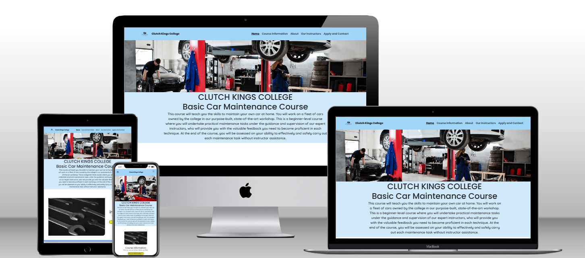

# Clutch Kings College - Basic Car Maintenance Course Website
# Milestone Project 1 - User Centric Frontend Development

<h2 align="center"></h2>

# Table of Contents 

## Contents
1. [Introduction](#introduction)
2. [Live Site](#live-site)
3. [Repository](#repository)
4. [User Experience](#user-experience)
    * [Strategy](#strategy)
         + [Site Owner Goals](#site-owner-goals)
         + [Site Manager Goals](#site-manager-goals)
         + [User Stories](#user-stories)
         + [User Goals](#user-goals)
           + [Must Have](#must-have)
           + [Should Have](#should-have)
           + [Could Have](#could-have)
         + [User Expectations and Requirements](#user-expectations-and-requirements)
    * [Scope](#scope)
        + [Initial Stage Features](#initial-stage-features)
        + [Future Additions](#future-additions)
    * [Structure](#structure)  
        + [Wireframes](#wireframes)
   * [Skeleton](#skeleton)  
        + [Layout](#layout)
          + [Information Architecture](#infomation-architecture)
            + [Navigation Bar](#navigation-bar)
            + [Sub-navigation Bar](#sub-navigation-bar)
            + [Navigation Buttons](#navigation-buttons)
            + [Call to Action Buttons](#call-to-action-buttons)
            + [Footer](#footer)
            + [Thank You Page](#thank-you)
            + [404 Error Page](#404-error-page)
   * [Surface](#surface)
        + [Design](#design)
          + [Colour Scheme](#colour-scheme)
          + [Typography](#typography)
          + [Imagery](#imagery)
          + [Icons](#icons)
          + [Logo](#logo)
          + [Favicons](#favicons)
   * [Technologies Used](#technologies-used)
        + [Languages](#languages)
        + [Frameworks Libraries and Programmes](#frameworks-libraries-and-programmes)
   * [Testing and Validation](#testing-and-validation)
   * [Bugs](#bugs)
        + [Resolved](#resolved)
        + [Unresolved](#unresolved)
   * [Deployment](#deployment)
        + [GitHub Pages](#github-pages)
        + [Forking the GitHub Repository](#forking-the-github-repository)
        + [Making a Local Clone](#making-a-local-clone)      
   * [Credits](#credits)
        + [Code](#code)
        + [Content](#content)
        + [Media](#media)
        + [Acknowledgments](#acknowledgments)
   * [Developer Comments](#developer-comments)
   * [Disclaimer](#disclaimer)

  
# Introduction
* Clutch Kings College is a fictional training provider for the automotive industry. This site focuses specifically on marketing and gathering sign-ups for their Basic Car Maintenance Course. 

* This is my first milestone project for the Code Institute Level 5 Diploma in Web Application Development.

# Live Site 
[The live site can be viewed here](https://lucyinthesky2111.github.io/milestone-project-one/)

# Repository
[The project repository can be viewed here](https://github.com/lucyinthesky2111/milestone-project-one)

# User Experience
  ## Strategy
  ### Site Owner Goals
  * To market their basic car maintenance course. 
  * To attract a wider range of participants through having an online presence.
  * To receive queries about the course from prospective students. 
  * To increase sign-ups for the course.  

  ### Site Manager Goals
  * For the HTML and CSS code to be clear, logical and contain explanatory comments in order to ensure the site is easy to update and maintain. 
  * For images to be downloaded to site manager's computer, not hosted by an external site to ensure images are always available for the user.  

  ### User Stories
  These can be found in my GitHub [project board](https://github.com/users/lucyinthesky2111/projects/7) for this repository.

  ### User Goals
  ### Must Have
  * To find pertinent details about the course (i.e. when and where it is run, how much it costs and what the entry requirements are) to ascertain whether there are any barriers to attending the course (user story 2).
  * To find a breakdown of the course contents in order to assess whether it meets their needs and requirements. (user story 2).
  * To find contact detailers for the course provider through a variety of different contact methods. (user story 3).
  * To see the course provider’s location on an embedded map. (user story 4). 
  * To be able to apply for the course quickly and easily online. (user story 5). 
  * To receive acknowledgment that their online application has been received, to include feedback on when they can expect a response. (user story 5).

  ### Should Have
  * To find photos and profiles for the course instructors. (user story 6).
  * To find information about the course provider. (user story 7).

  ### Could Have
  * To read testimonials from current and/or former students. (user story 8).
  * To see a virtual tour of the workshop. (user story 9).
  * To sign-up to receive email notifications when new course dates are added. (user story 10).

### User Expectations and Requirements
* (all user story 1) (must-have) 
* To find the website easy to access and navigate on any screen size. 
* For the site to be fully accessible. 
* For the site to be engaging and visually appealing, including high quality images with succinct but adequate descriptions. 
* For any external links to open in a new tab. 
* To find a navigation menu at the top of every page. 
* To find a footer at the bottom of every page. 
* To receive a custom 404 error page which links back to the Homepage, when trying to access an incorrect URL within the site. 

# Surface
 ## Design
 ### Colour Scheme
  ### Typography
   ### Imagery

# Testing and Validation
Please refer to [this file](TESTING.md) for details of the testing and validation undertaken.

# Disclaimer

This project is for educational purposes only and was created for the Code Institute assessed project for the ‘user centric front-end development’ module.  

Clutch Kings College is a fictional training provider. Any similarity to any real college, address or other contact information, or to any persons, living or deceased, is purely coincidental. 
 
Created by Lucy Kidner, 2025. 