# Testing

The Clutch Kings College Basic Car Maintenance Course website has been tested using the following methods:
- [Code Validation](#code-validation)
    - [W3C HTML Validator](#w3c-html-validator) 
        - [Homepage](#homepage)
        - [Course Information Page](course-information-page)
        - [About Page](#about-page)
        - [Meet Instructors Page](#meet-instructors-page)
        - [Apply and Contact Page](#apply-and-contact-page)
        - [Thank You Page](#thank-you-page)
        - [404 Error Page](#404-error-page)
    - [W3C CSS Validator](#w3c-css-validator)
- [Lighthouse](#lighthouse)
- [Responsiveness](#responsiveness)
- [WAVE Web Accessibility Evaluation Tools Checker](#wave-web-accessibility-evaluation-tools-checker)
- [Browser Compatibility](#browser-compatibility)
- [Testing User Stories](#testing-user-stories)
- [Peer Review](#peer-review)
- [Bugs](#bugs)
    - [Resolved](#resolved)
    - [Unresolved](#unresolved)

    Back to [README.md](/README.md#testing-and-validation)

# Code Validation
## W3C HTML Validator
The Clutch Kings College Basic Car Maintenance Course webpage returned no errors when tested using the W3C HTML Validator tool. There was one warning given as shown in the screenshots, about sections not having a heading. This was not changed as the sections do not need headings and adding these is only a recommendation not a requirement.
### Homepage
<h2 align="center">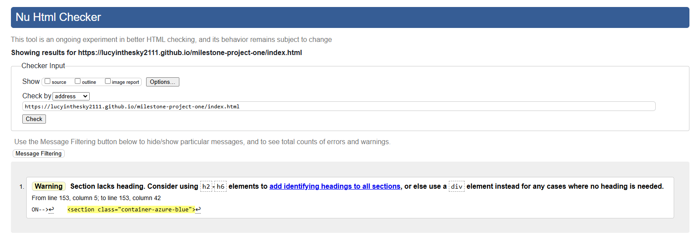</h2>

### Course Infomation Page
<h2 align="center">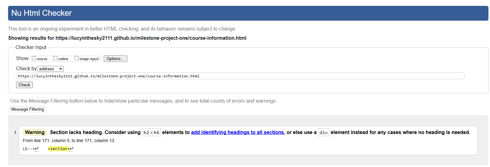</h2>

### About Page
<h2 align="center">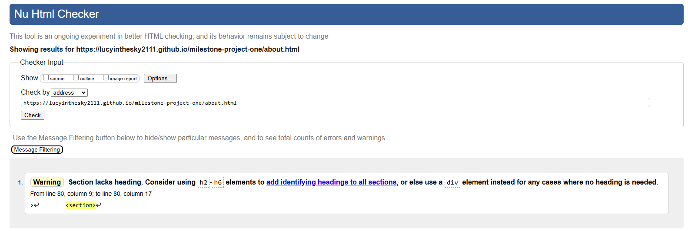</h2>

### Our Instructors Page
<h2 align="center">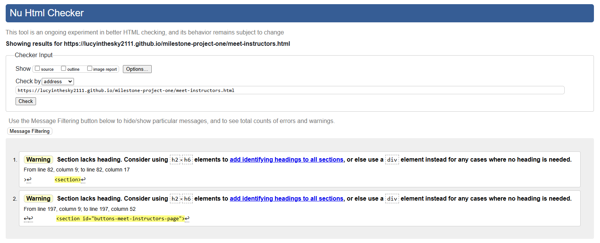</h2>

### Apply and Contact Page
<h2 align="center">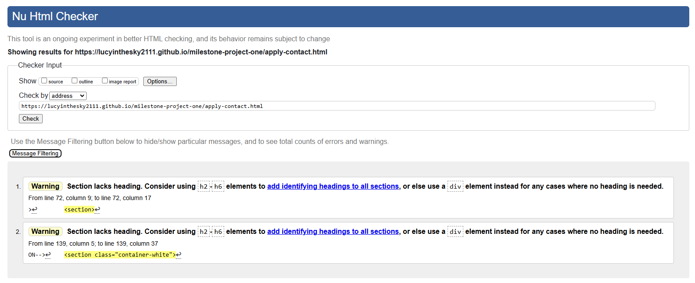</h2>

### Thank You Page
<h2 align="center">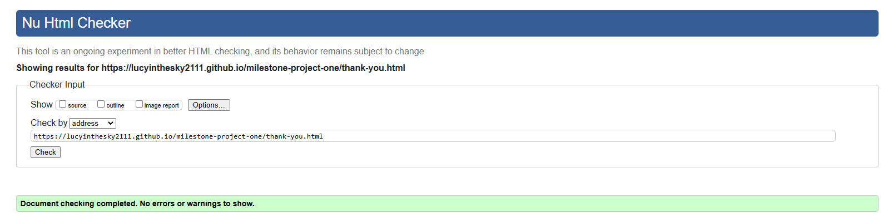</h2>

### 404 Error Page
<h2 align="center">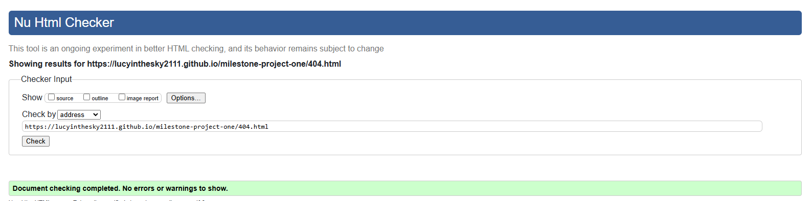</h2>

## W3C CSS Validator
The Clutch Kings College Basic Car Maintenance Course webpage returned no errors or warnings when tested using the W3C CSS Validator tool.
### CSS Stylesheet
<h2 align="center">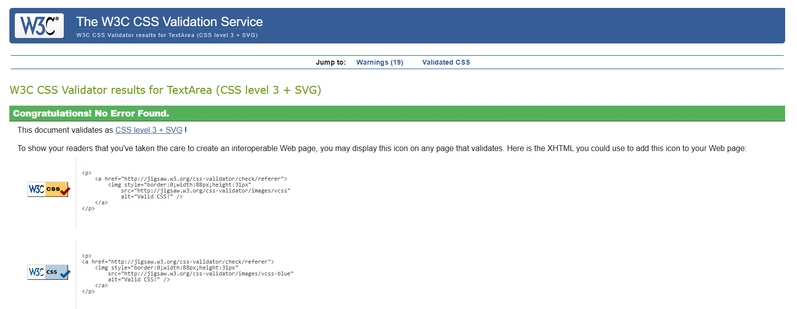</h2>

# Lighthouse
* I ran Lighthouse reports in Google Devtools to test for :- Performance, Accessibility, Best Practices and SEO.
* All pages performed reasonably well on desktop: 
## Homepage (Desktop)
<h2 align="center">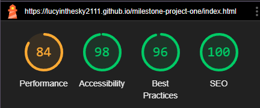</h2>

## Course Information Page (Desktop)
<h2 align="center"></h2>

## About Page (Desktop)
<h2 align="center">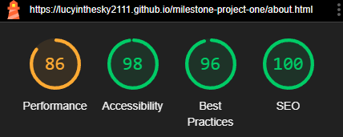</h2>

## Our Instructors Page (Desktop)
<h2 align="center">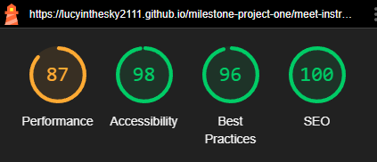</h2>

## Apply and Contact Page (Desktop)
<h2 align="center">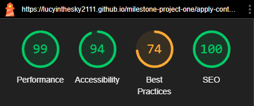</h2>

## Thank You Page (Desktop) 
<h2 align="center">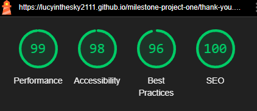</h2>

## 404 Error Page (Desktop) 
<h2 align="center">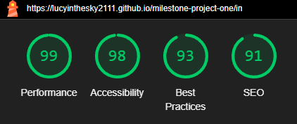</h2>

* On mobile, results were not so good on many pages. Details can be found in [Unresolved Bugs](#unresolved).
## Homepage (Mobile)
<h2 align="center">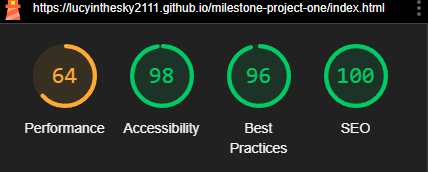</h2>

## Course Information Page (Mobile)
<h2 align="center">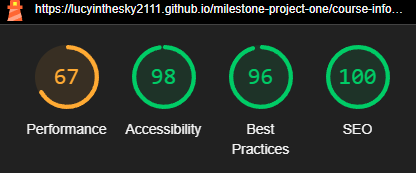</h2>

## About Page (Mobile)
<h2 align="center">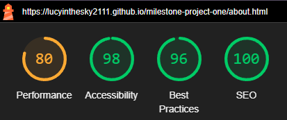</h2>

## Our Instructors Page (Mobile)
<h2 align="center">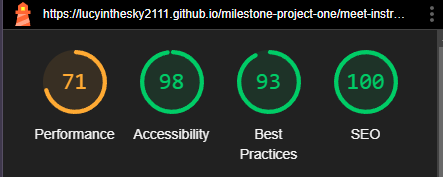</h2>

## Apply and Contact Page (Mobile)
<h2 align="center">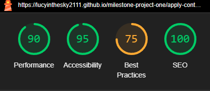</h2>

## Thank You Page (Mobile)
<h2 align="center">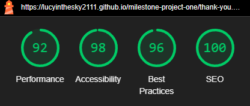</h2>

## 404 Error Page (Mobile)
<h2 align="center">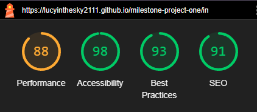</h2>

# Responsiveness
A combination of Bootstrap and CSS media queries were used to make this website responsive. When writing media queries, I used the same breakpoints as Bootstrap. Details of these breakpoints can be found [here](https://getbootstrap.com/docs/5.0/layout/breakpoints/). Responsivity at the Bootstrap breakpoints and on different device screen sizes was tested using Google Chrome Devtools. Device screen sizes tested include:
* iPhone SE
* iPhone XR
* iPhone 12 Pro
* iPhone 14 Pro Max
* Pixel 7
* Samsung Galaxy S8+
* Samsung Galaxy S20 Ultra
* iPad Mini
* iPad Air
* iPad Pro
* Surface Pro 7
* Surface Duo
* Galaxy Z Fold 5
* Asus Zenbook Fold
* Samsung Galaxy A51/71
* Nest Hub
* Nest Hub Max
* Galaxy Fold

* I personally tested the website on a Samsung Galaxy S22 (See [Resolved Bugs](#resolved)) for details and an Asus Tuf Gaming A15.

# WAVE Web Accessibility Evaluation Tools Checker
The Clutch Kings College Basic Car Maintenance Course webpage returned no errors or contrast errors when tested using the WAVE Web Accessibility Evaluation Tools Checker.
## Homepage 
<h2 align="center">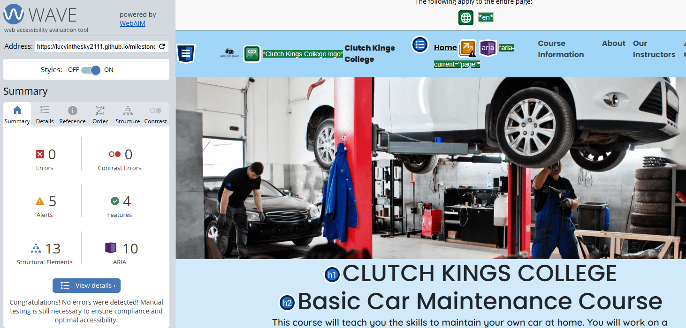</h2>

## Course Information Page 
<h2 align="center">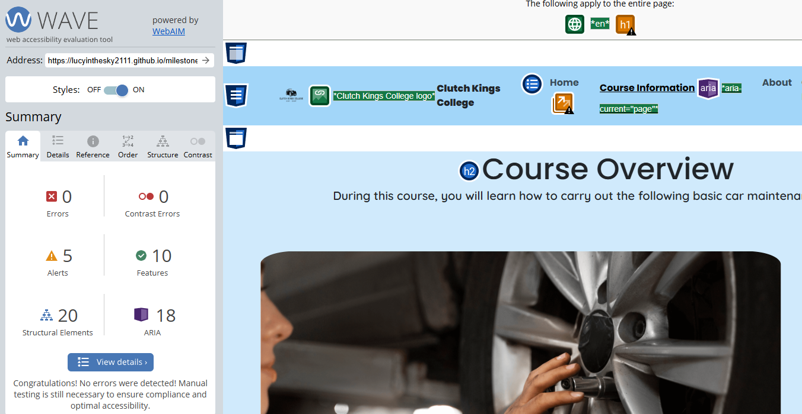</h2>

## About Page 
<h2 align="center"></h2>

## Our Instructors Page 
<h2 align="center">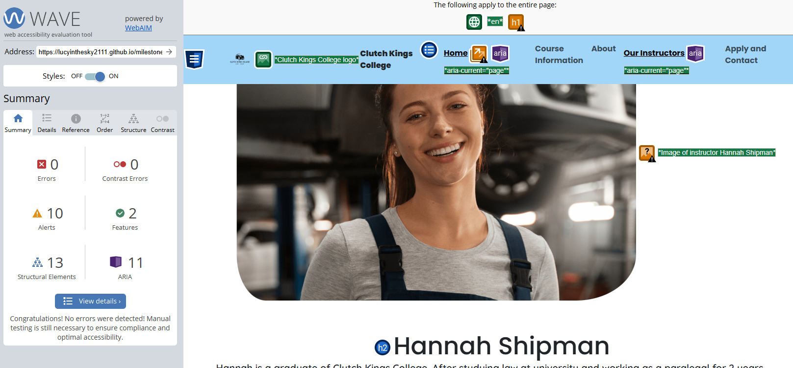</h2>

## Apply and Contact Page
<h2 align="center">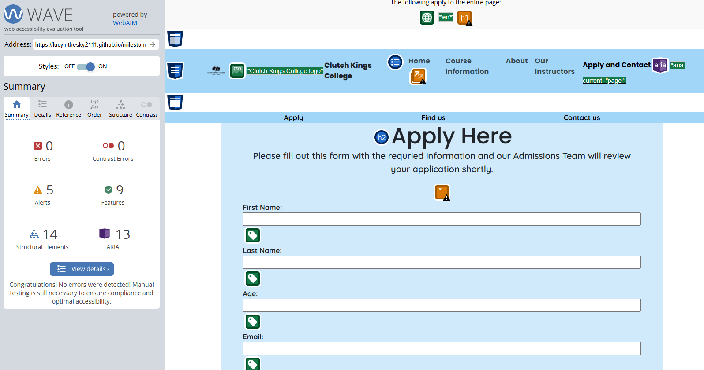</h2>

## Thank You Page 
<h2 align="center">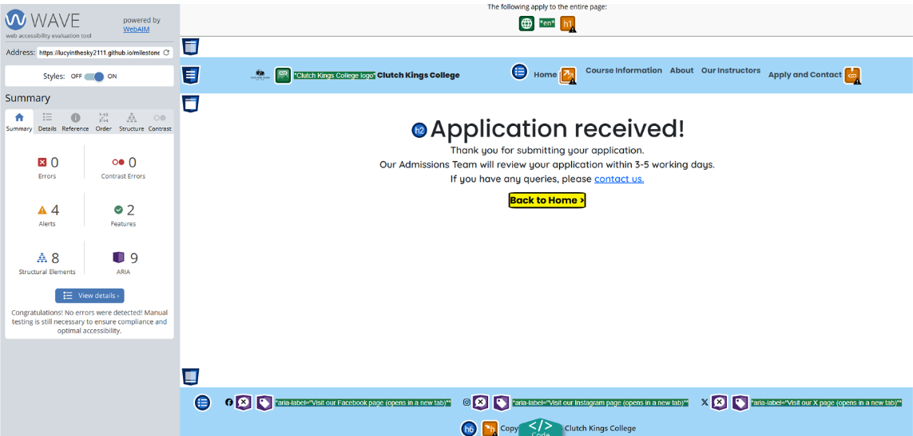</h2>

## 404 Error Page  
<h2 align="center">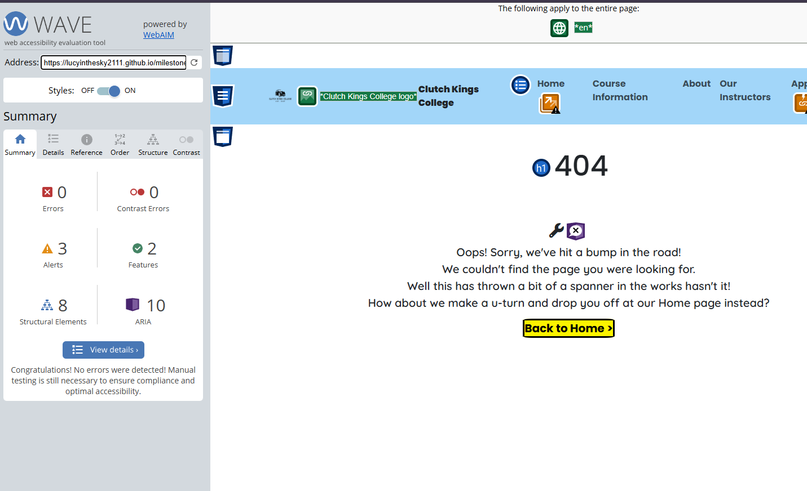</h2>

# Browser Compatibility
* The site was tested and performed as expected on Google Chrome and Microsoft Edge.
* The site was also tested on Samsung Internet, on which there were some issues (See [Resolved Bugs](#resolved) for details).

# Testing User Stories
* All tasks are completed and all acceptance criteria are met for User Stories 1-7. Due to time constraints, no tasks have been attempted for User Stories 8-10.

# Peer Review
* Whilst still in progress, this project was submitted for peer review by Code Institute students and alumni on Slack. This resulted in me receiving

# Bugs 
## Resolved
* The Apply and Contact Page initially returned an error due to the inline styles applied to the iFrame element. This was resolved by removing the inline styles and adding the styles directly to the stylesheet instead.
<h2 align="center">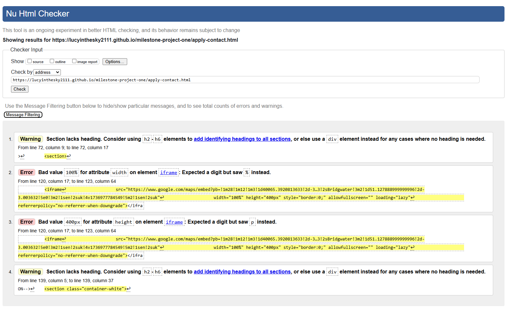</h2>

Contrast error on scroll controls on BS carousel on About page

## Unresolved
* Best practice low score on apply page on desktop
