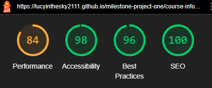

# Testing

The Clutch Kings College Basic Car Maintenance Course website has been tested using the following methods:
- [Code Validation](#code-validation)
    - [W3C HTML Validator](#w3c-html-validator) 
        - [Homepage](#homepage)
        - [Course Information Page](course-information-page)
        - [About Page](#about-page)
        - [Meet Instructors Page](#meet-instructors-page)
        - [Apply and Contact Page](#apply-and-contact-page)
        - [Thank You Page](#thank-you-page)
        - [404 Error Page](#404-error-page)
    - [W3C CSS Validator](#w3c-css-validator)
- [Lighthouse](#lighthouse)
- [Responsiveness](#responsiveness)
- [WAVE Web Accessibility Evaluation Tools Checker](#wave-web-accessibility-evaluation-tools-checker)
- [Browser Compatibility](#browser-compatibility)
- [Testing User Stories](#testing-user-stories)
- [Testing User Goals](#testing-user-goals)
- [Testing User Expectations and Requirements](#testing-user-expectations-and-requirements)
- [Peer Review](#peer-review)
- [Bugs](#bugs)
    - [Resolved](#resolved)
    - [Unresolved](#unresolved)

# Code Validation
## W3C HTML Validator
The Clutch Kings College Basic Car Maintenance Course webpage returned no errors when tested using the W3C HTML Validator tool. There was one warning given as shown in the screenshots, about sections not having a heading. This was not changed as the sections do not need headings and adding these is only a recommendation, not a requirement.
### Homepage
<h2 align="center"></h2>

### Course Infomation Page
<h2 align="center"></h2>

### About Page
<h2 align="center"></h2>

### Our Instructors Page
<h2 align="center"></h2>

### Apply and Contact Page
<h2 align="center"></h2>

### Thank You Page
<h2 align="center"></h2>

### 404 Error Page
<h2 align="center"></h2>

## W3C CSS Validator
The Clutch Kings College Basic Car Maintenance Course webpage returned no errors or warnings when tested using the W3C CSS Validator tool.
### CSS Stylesheet
<h2 align="center"></h2>

# Lighthouse
* I ran Lighthouse reports in Google Devtools to test for :- Performance, Accessibility, Best Practices and SEO.
* All pages performed reasonably well on desktop (with some performing very well): 
## Homepage (Desktop)
<h2 align="center"></h2>

## Course Information Page (Desktop)
<h2 align="center"></h2>

## About Page (Desktop)
<h2 align="center"></h2>

## Our Instructors Page (Desktop)
<h2 align="center"></h2>

## Apply and Contact Page (Desktop)
<h2 align="center"></h2>

## Thank You Page (Desktop) 
<h2 align="center"></h2>

## 404 Error Page (Desktop) 
<h2 align="center"></h2>

* On mobile, results were not so good on many pages. Details can be found in [Unresolved Bugs](#unresolved).
## Homepage (Mobile)
<h2 align="center"></h2>

## Course Information Page (Mobile)
<h2 align="center"></h2>

## About Page (Mobile)
<h2 align="center"></h2>

## Our Instructors Page (Mobile)
<h2 align="center"></h2>

## Apply and Contact Page (Mobile)
<h2 align="center"></h2>

## Thank You Page (Mobile)
<h2 align="center"></h2>

## 404 Error Page (Mobile)
<h2 align="center"></h2>

# Responsiveness
A combination of Bootstrap and CSS media queries were used to make this website responsive. When writing media queries, I used the same breakpoints as Bootstrap. Details of these breakpoints can be found [here](https://getbootstrap.com/docs/5.0/layout/breakpoints/). Responsivity at the Bootstrap breakpoints, and on different device screen sizes, was tested using Google Chrome Devtools. Device screen sizes tested include:
* iPhone SE
* iPhone XR
* iPhone 12 Pro
* iPhone 14 Pro Max
* Pixel 7
* Samsung Galaxy S8+
* Samsung Galaxy S20 Ultra
* iPad Mini
* iPad Air
* iPad Pro
* Surface Pro 7
* Surface Duo
* Galaxy Z Fold 5
* Asus Zenbook Fold
* Samsung Galaxy A51/71
* Nest Hub
* Nest Hub Max
* Galaxy Fold

* I personally tested the website on a Samsung Galaxy S22 (See [Resolved Bugs](#resolved) for details) and an Asus Tuf Gaming A15 laptop.

# WAVE Web Accessibility Evaluation Tools Checker
The Clutch Kings College Basic Car Maintenance Course webpage returned no errors or contrast errors when tested using the WAVE Web Accessibility Evaluation Tools Checker. 
## Homepage 
<h2 align="center"></h2>

## Course Information Page 
<h2 align="center"></h2>

## About Page 
<h2 align="center"></h2>

## Our Instructors Page 
<h2 align="center"></h2>

## Apply and Contact Page
<h2 align="center"></h2>

## Thank You Page 
<h2 align="center"></h2>

## 404 Error Page  
<h2 align="center"></h2>

# Browser Compatibility
* The site was tested and performed as expected on Google Chrome, Microsoft Edge, and Internet Explorer.
* The site was also tested on Samsung Internet, on which there were some issues which were subsequently rectified. (see [Resolved Bugs](#resolved) for details).

# Testing User Stories
* All tasks are completed and all acceptance criteria are met for user stories 1-7. 
* Due to time constraints, no tasks have been attempted for user stories 8-10.

# Testing User Goals
### Must Have
  * To find pertinent details about the course (i.e. when and where it is run, how much it costs and what the entry requirements are) to ascertain whether there are any barriers to attending the course (user story 2).
    * There is a table in the 'Course Summary' section on the Course Information page, which gives the user all the essential information in an easy to read format.
    <h2 align="center"></h2>

  * To find a breakdown of the course contents, in order to assess whether it meets their needs and requirements. (user story 2).
    * The 'Course Overview' section of the Course Information page shows what the course covers. 
    * The section consists of an appropriate image representing each maintenance task taught during the course, and a corresponding, appropriate icon and text caption. 
    * Each icon and image has appropriate alt text to describe it for screen readers or in case it fails to load.
    * As the tasks on this course are basic, I felt that the images and captions sufficiently described them for the user, without the need for any additional explanatory text. 
     <h2 align="center"></h2>

  * To find contact details for the course provider, through a variety of different contact methods. (user story 3).
    * The Apply and Contact page contains a 'Contact Us' section which provides details needed to contact the college by post, telephone, or email.
    * The footer (which appears on all pages), also contains links to the college's social media accounts, through which the user could also contact them.
    <h2 align="center"></h2>
    <h2 align="center"></h2>
    <h2 align="center"></h2>

  * To see the course provider’s location on an embedded map. (user story 4). 
    * The Apply and Contact Us page 'Find Us' section features an interactive, embeddded Google map showing the college's location.
    <h2 align="center"></h2>

  * To be able to apply for the course quickly and easily online. (user story 5). 
     * The Apply and Contact Us page 'Apply Here' section contains a fully validated application form.
     * All fields in the form are required.
     * When inputting their age, the form provides the user with a warning that the minimum age is 16. This is in accordance with the entry requirements set out in the table in the ‘Course Summary’ section of the Course Overview page.

     <h2 align="center"></h2>

  * To receive acknowledgment that their online application has been received, which includes feedback on when they can expect a response. (user story 5).
    * Upon submitting an application with all required fields completed, the user is directed to a 'Thank You' page which explains that they can expect a response with 3-5 working days.
    <h2 align="center"></h2>

 ### Should Have
  * To find photos and profiles of the course instructors. (user story 6).
    * There is a dedicated 'Our Instructors' page which contains profiles and photos of all instructors.
    * Each instructor's image has appropriate alt text to describe it for screen readers or in case it fails to load.
    <h2 align="center"></h2>

  * To find information about the course provider. (user story 7).
    * There is an About page, which featues a bio of the College.
    * The About page also features a scrollable image carousel showing the user different views of the college's workshop, and some of their cars and tools.
    * The image carousel does not scroll automatically, so as not to annoy the user. The user can manually scroll through the images using the directional arrows. 
    * There is also a 'progress indicator bar' at the bottom of the image carousel, to show the user how many images the carousel contains, and to indicate to the user which of those images they are currently viewing.
    * The images on the carousel all have appropriate alt text to describe them for screen readers or in case they fail to load.
    <h2 align="center"></h2>

 ### Could Have
  * Due to time constraitnts, none of the features relating to the 'could have' user goals have been implemented.

# Testing User Expectations and Requirements
All user expectations and requirements have been satisified (evidenced by looking at the deployed site as a whole).

# Peer Review
* Whilst still in progress, this project was submitted for peer review by Code Institute students and alumni on Slack. This resulted in me receiving help with a spacing issue on the footer and with the responsiveness of the site (see [README.md Credits section](/README.md#credits) for details). I would have liked to have re-submitted the project for further feedback once it was finished but there was not enough time to do this.
* The project was also reviewed by my mentor Mitko Bachvarov, who suggested that I improve the site by styling the application form submit button on the Apply and Contact page, to match the buttons on the rest of the site. It was also suggested that I improve the layout of the site by adding extra margins and padding where required. These changes were implemented. The navbar originally contained 2 links that went to the same page (1 link labelled Apply and 1 labelled Contact, both going to the Apply and Contact page). On my mentor's advice, the text on the links was amalgamated and one link was removed.
* I asked a number of friends and family members to test the site for typos, to check the application form validates and directs to the thank you page, to check all links work correctly and that the external links to social media sites in the footer all open in new tabs. Some minor typos were reported and subsequently corrected. No errors with links or form validation were reported.
* I also asked ChatGPT to proof-read each page of the site. It suggested a few minor re-writes to make the copy more concise, which were implemented. It also suggested adding a friendly line to the ‘Contact Us’ section on the Apply and Contact page, inviting users to contact the college. As a result, the text shown under 'Contact Us' was added:
<h2 align="center"></h2>

# Bugs 
## Resolved
* The Apply and Contact Page initially returned an error due to the inline styles applied to the iFrame element. This was resolved by removing the inline styles and adding the styles directly to the stylesheet instead.
<h2 align="center"></h2>

* On first run of the W3C HTML Validitor, the error shown below was flagged on all pages of the site. This was resolved by removing the button element and styling the a element as a button. All pages of the site subsequently passed validation.
<h2 align="center"></h2>

* I noticed that on mobile view on my personal device (Samsung Galaxy S22), the introductory text under the college and course name on the Homepage, was spilling out of its containing div into the one beneath it. This issue was only occurring on this particular device, it did not happen in mobile screen size views on Devtools. I inspected the page on Devtools and was able to ascertain that the issue was stemming from the manual height I had set on the containing div (#course-intro). Changing this value to ‘fit-content’ resolved this issue. 

* I noticed that on mobile and tablet screens, there was a gap between the sections for Steve and Becky on the ‘Our Instructors’ page that was not there on larger screens. Upon inspecting the page in Dev tools, I saw that this issue was rectified by adding a margin-top value of –16px to the div with the id of Becky Ludlington. 

## Unresolved
* Lower Lighthouse performance scores on mobile. To improve performance, Lighthouse recommends saving images in next-gen formats and eliminating render-blocking resources. This was not implemented due to time constraints. 

* Lower Lighthouse best practice score on Apply and Contact page on both desktop and mobile. To improve the best practice score, Lighthouse recommends not using third-party cookies. This is an issue I cannot resolve at the moment, third-party cookies is outside of my knowledge range at this stage in my learning journey, and due to time pressures, I was unable to research this before the project deadlinea.

Back to [README.md](/README.md#testing-and-validation)